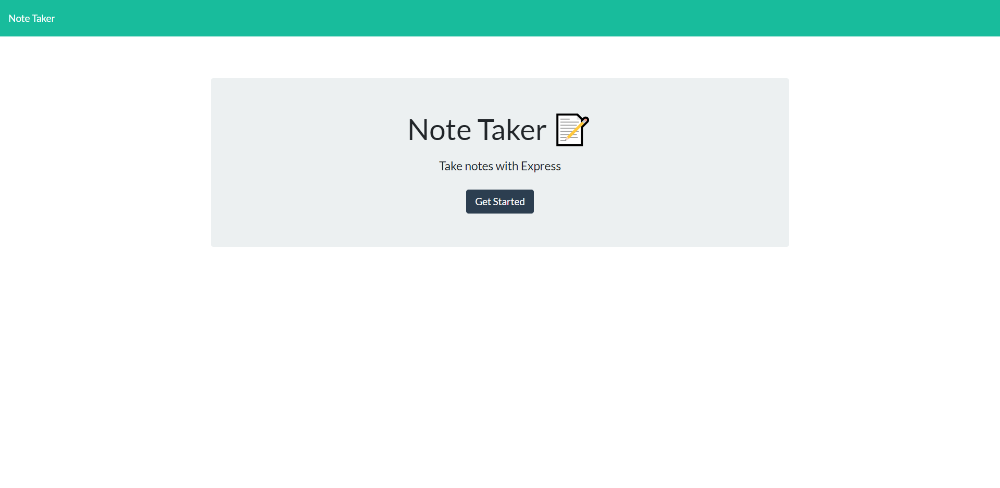
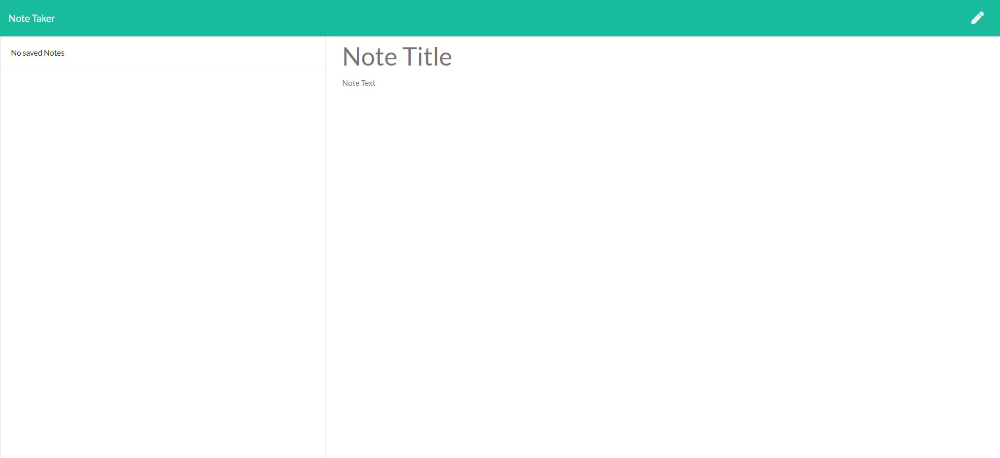
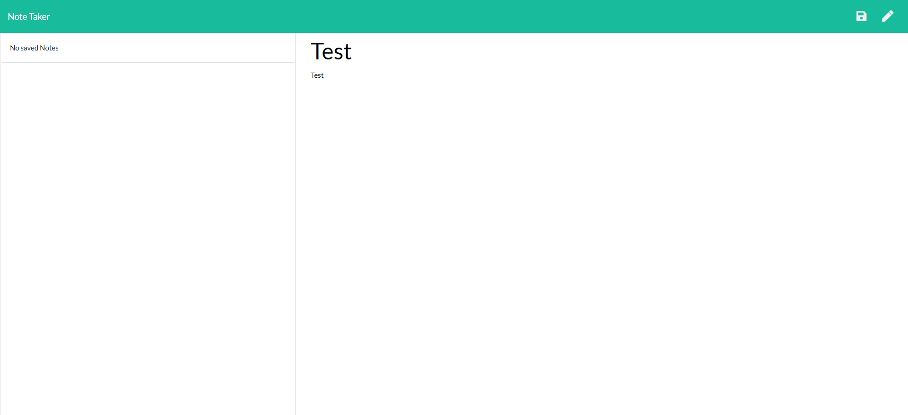
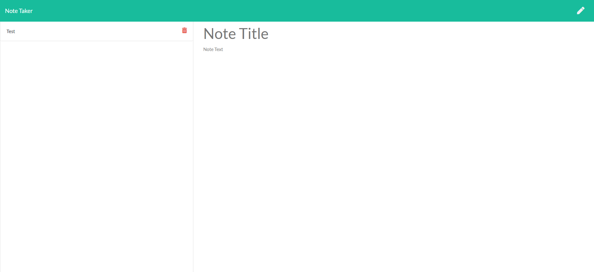
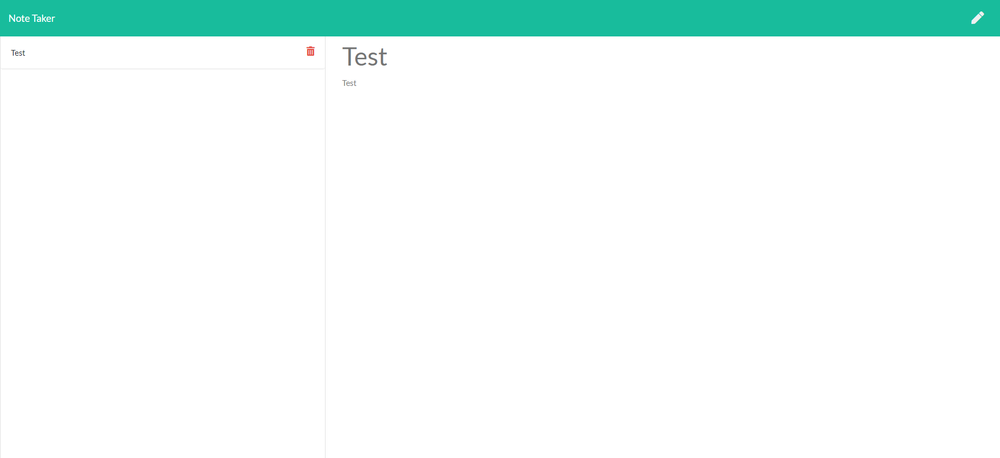

# NickP_Note_Taker

## Description 

This a simple website that will allow user to take notes and save them, and delete them as well. It will be hosted via Heroku and run live. You can view past notes as well. 

## Table of Contents

  * [Usage](#usage)
  * [Contributing](#contributing)
  * [Questions](#questions)
  * [Links](#links)

## Usage

  Open the URL then click the get started button. It will take you to the note taking page. Enter the title of the note, and then start typing out your note. You will see a save button appear when you have both title the note text inputs filled out. Click the save button and it will save your note. You can view past notes on the left and delete them as you see fit.

  
  
  
  
  

## Contributing

## Questions

  How to reach me?
  GitHub: https://github.com/Nickpodski
  Email: Nickpodski@gmail.com

## Links 

https://evening-reaches-59327.herokuapp.com/ - Live Url

https://evening-reaches-59327.herokuapp.com/notes - Notes Page

https://github.com/Nickpodski/NickP_Note_Taker - Github Repo!
